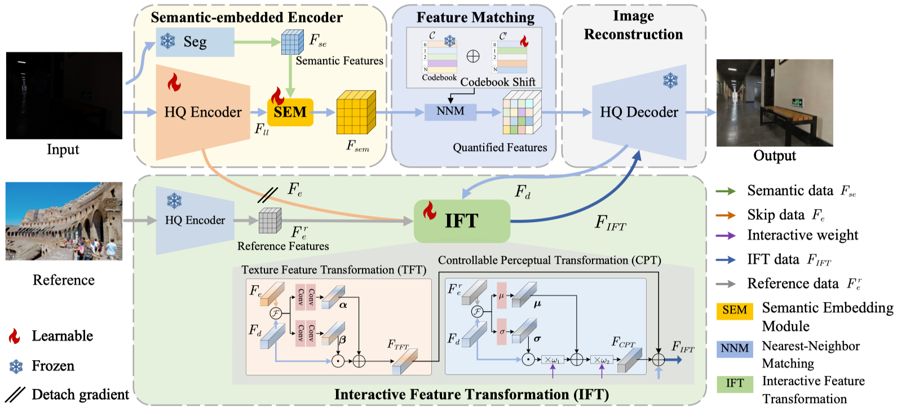
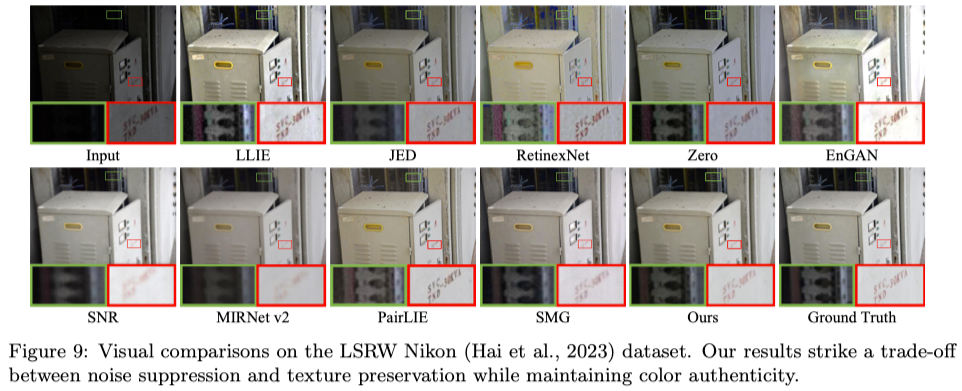
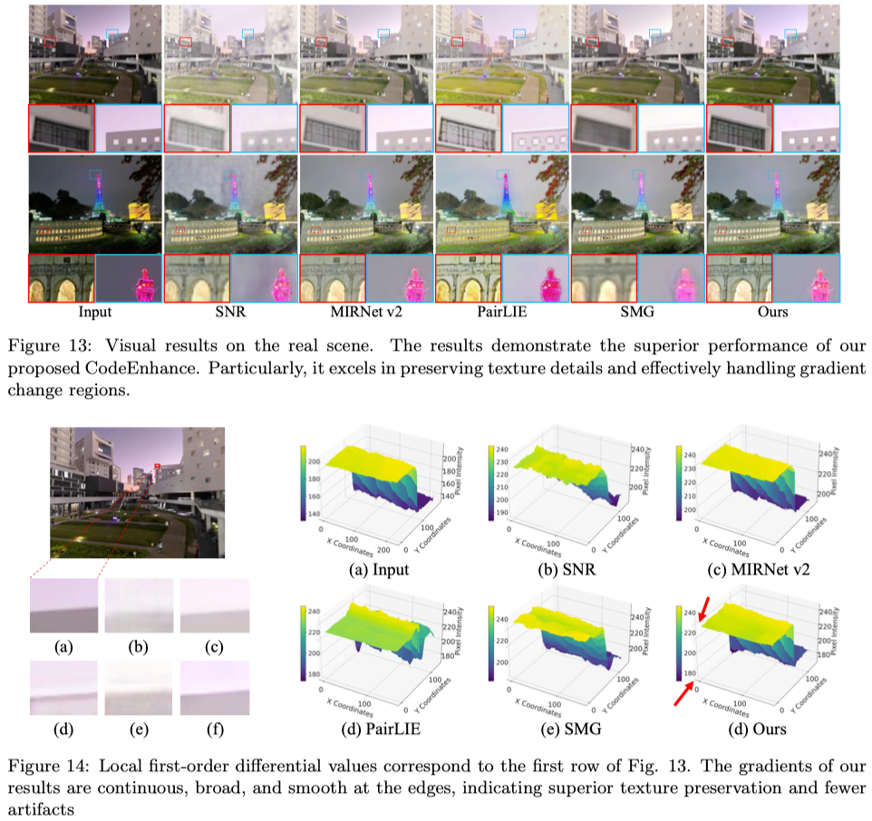

# CodeEnhance
This is the official PyTorch codes for the paper: [A Codebook-Driven Approach for Low-Light Image Enhancement](https://arxiv.org/pdf/2404.05253)
>Wu, Xu, et al. "CodeEnhance: A Codebook-Driven Approach for Low-Light Image Enhancement." arXiv preprint arXiv:2404.05253 (2024).
>This paper has been accepted to the Engineering Applications of Artificial Intelligence (EAAI).



## Abstract:
Low-light image enhancement (LLIE) aims to improve low-illumination images. How- ever, existing methods face two challenges: (1) uncertainty in restoration from diverse brightness degradations; (2) loss of texture and color information caused by noise suppres- sion and light enhancement. In this paper, we propose a novel enhancement approach, CodeEnhance, by leveraging quantized priors and image refinement to address these chal- lenges. In particular, we reframe LLIE as learning an image to-code mapping from low-light images to discrete codebook, which has been learned from high-quality images. To enhance this process, a Semantic Embedding Module (SEM) is introduced to integrate semantic information with low-level features, and a Codebook Shift (CS) mechanism, de- signed to adapt the pre-learned codebook to better suit the distinct characteristics of our low-light dataset. Additionally, we present an Interactive Feature Transformation (IFT) module to refine texture and color information during image reconstruction, allowing for interactive enhancement based on user preferences. Extensive experiments on both real- world and synthetic benchmarks demonstrate that the incorporation of prior knowledge and controllable information transfer significantly enhances LLIE performance in terms of quality and fidelity. The proposed CodeEnhance exhibits superior robustness to various degradations, including uneven illumination, noise, and color distortion.

## Experiments:
### LSRW


### Real World


## Dependencies and Installation

- CUDA >= 11.0
- Other required packages in `codeenhance.yaml`

### Test CodeEnhance
setting the path of dataset and model pth in `options/test_Unpaired_codeenhance.yaml`

setting the `weight_style` and ` weight_light` in `options/test_Unpaired_codeenhance.yaml` to control contrast and illumination level of enhanced image.

python test.py

### Train CodeEnhance
setting config of model and the path of dataset and pretrained pth in `options/FiveK.yaml` (AGLLNet/LOLv1/LSRW_Huawei/LSRW_Nikon)

python train.py


## Citation
If you find our repo useful for your research, please cite us:
```
@article{wu2024codeenhance,
  title={CodeEnhance: A Codebook-Driven Approach for Low-Light Image Enhancement},
  author={Wu, Xu and Hou, XianXu and Lai, Zhihui and Zhou, Jie and Zhang, Ya-nan and Pedrycz, Witold and Shen, Linlin},
  journal={arXiv preprint arXiv:2404.05253},
  year={2024}
}
```

## License
Licensed under a [Creative Commons Attribution-NonCommercial 4.0 International](https://creativecommons.org/licenses/by-nc/4.0/) for Non-commercial use only.
Any commercial use should get formal permission first.

## Acknowledgement
This repository is maintained by [Xu Wu](https://csxuwu.github.io/).
